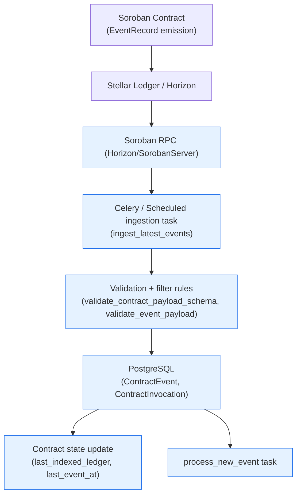
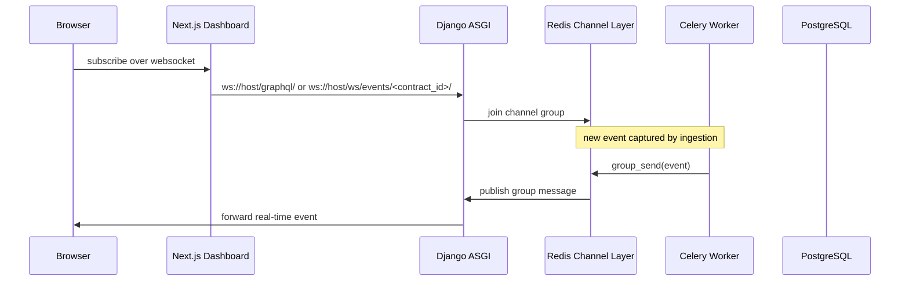
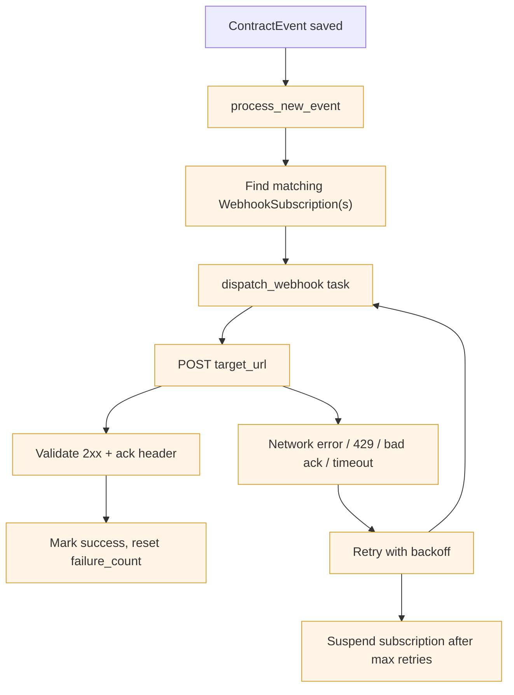
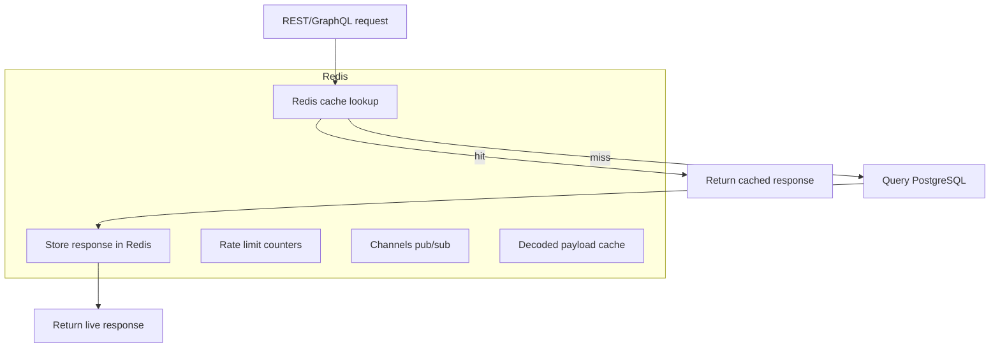
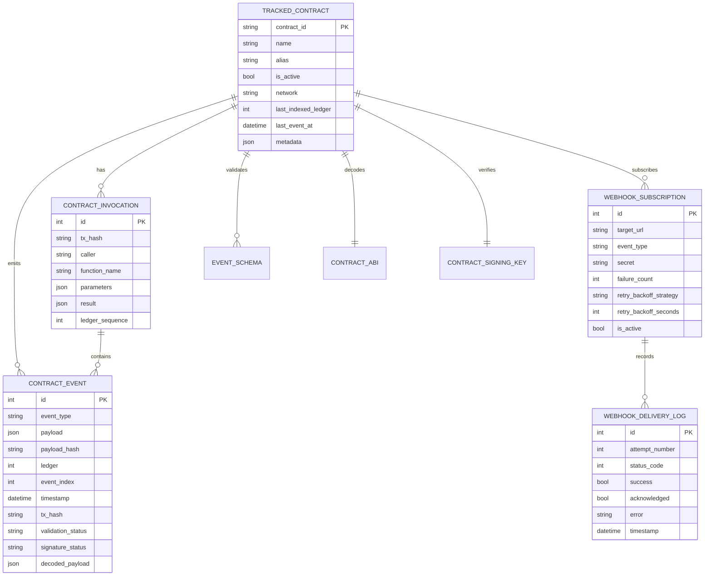

# SoroScan Architecture Overview

This document is the definitive architecture reference for SoroScan. It explains how the system works end-to-end, including event ingestion, storage, query APIs, real-time delivery, webhook dispatch, caching, schema design, and deployment. It is intended for developers onboarding on the project, maintainers, and architects.

## Table of Contents

- [Purpose](#purpose)
- [Architecture Summary](#architecture-summary)
- [High-Level System Diagram](#high-level-system-diagram)
- [Component Descriptions](#component-descriptions)
  - [Soroban Smart Contract](#soroban-smart-contract)
  - [Ingestion Layer](#ingestion-layer)
  - [Storage Layer](#storage-layer)
  - [Query Layer](#query-layer)
  - [Webhook Dispatcher](#webhook-dispatcher)
  - [Admin & Dashboard Layer](#admin--dashboard-layer)
- [Technology Stack Justification](#technology-stack-justification)
- [Data Flow Diagrams](#data-flow-diagrams)
  - [Event Ingestion Pipeline](#event-ingestion-pipeline)
  - [Real-Time Subscription Flow](#real-time-subscription-flow)
  - [Webhook Dispatch and Retry Logic](#webhook-dispatch-and-retry-logic)
  - [Caching Strategy](#caching-strategy)
- [Database Schema Documentation](#database-schema-documentation)
  - [ER Diagram](#er-diagram)
  - [Table Descriptions](#table-descriptions)
  - [Indexing Strategy](#indexing-strategy)
  - [Migration Workflow](#migration-workflow)
- [API Architecture](#api-architecture)
  - [REST API Design Principles](#rest-api-design-principles)
  - [GraphQL Schema Organization](#graphql-schema-organization)
  - [Authentication and Authorization](#authentication-and-authorization)
  - [Rate Limiting Strategy](#rate-limiting-strategy)
- [Deployment Architecture](#deployment-architecture)
- [Design Decision Records (ADRs)](#design-decision-records-adrs)
- [Code References](#code-references)

## Purpose

SoroScan is an event indexing and delivery platform for Soroban smart contracts on Stellar. The system is designed to:

- collect on-chain contract events reliably;
- validate, normalize, and persist event data;
- expose search and query APIs through REST and GraphQL;
- support real-time subscriptions and webhook push delivery;
- provide auditability, resiliency, and deployment-ready infrastructure.

This document is intentionally implementation-aware: it uses real code references from the repository so developers can navigate from architecture to source quickly.

## Architecture Summary

SoroScan is a hybrid on-chain/off-chain system. The Soroban smart contract emits structured events on the Stellar ledger. The backend listens to Horizon / Soroban RPC, ingests those events, enriches them, stores them in PostgreSQL, and exposes them through a modern API surface.

Key architectural principles:

- **Separation of concerns**: ingestion, storage, query, and delivery are distinct layers.
- **Event-first**: the contract is the source of truth, and all downstream systems are derived from event data.
- **Resilient delivery**: webhooks are delivered asynchronously with retry and dead-letter support.
- **Cache-backed performance**: Redis is used for rate limiting, query caching, decoded payload caching, and Channels pub/sub.
- **Incremental sync**: the ingestion pipeline processes new ledgers incrementally and tracks cursor state.

## High-Level System Diagram

```mermaid
flowchart TD
    subgraph On-Chain
        A[Soroban Contract\n(EventRecord emission)]
        B[Stellar Ledger]
        C[Horizon / Soroban RPC]
    end

    subgraph Backend
        D[Ingestion Task / Scheduler]
        E[Validation + Decoding]
        F[PostgreSQL Storage]
        G[Celery Task Queue]
        H[Real-Time Delivery]
        I[Webhook Delivery]
        J[Cache / Redis]
        K[GraphQL/REST API]
    end

    subgraph Frontend
        L[Next.js Dashboard]
        M[WebSocket Client]
    end

    A --> B --> C --> D
    D --> E --> F
    F --> G
    G --> H
    G --> I
    H --> M
    I --> ThirdParty[Subscriber Systems]
    K --> L
    J --> D
    J --> K
    J --> H
    J --> I
    K --> L
```

## Component Descriptions

### Soroban Smart Contract

The smart contract lives in `soroban-contracts/soroscan_core/` and is the canonical source of event data. Its responsibilities are:

- emit strongly typed `EventRecord` events from contract function invocations;
- store minimal metadata required for verification and traceability;
- allow only authorized indexers to write event records.

Because SoroScan is event-driven, the contract is intentionally kept lightweight. The backend does the heavy lifting of indexing, validation, filtering, and delivery.

### Ingestion Layer

The ingestion layer is responsible for consuming on-chain events and turning them into persisted records.

Primary implementation points:

- `django-backend/soroscan/ingest/tasks.py` — key ingestion task `ingest_latest_events`
- `django-backend/soroscan/ingest/management/commands/ingest_events.py` — manual ingest command
- `django-backend/soroscan/ingest/stellar_client.py` — Soroban RPC client and transaction helpers
- `django-backend/soroscan/ingest/rate_limit.py` — ingest rate limiting logic

Responsibilities:

- poll Horizon/Soroban RPC for new contract events;
- honor incremental sync state using `IndexerState` cursor values;
- load only active tracked contracts;
- validate and filter events before persisting;
- create invocation records when transaction metadata is available;
- update contract `last_indexed_ledger` and `last_event_at`.

### Storage Layer

PostgreSQL is the persistent store for all indexed data. The Django models define the contract, event, webhook, and delivery schema.

Core storage models:

- `TrackedContract` — contract registration, filters, network, status, and metadata.
- `ContractEvent` — indexed events, payload, signature status, validations, and decoding output.
- `ContractInvocation` — invocation metadata for function calls that emitted events.
- `WebhookSubscription` — webhook subscriber configuration and retry policy.
- `WebhookDeliveryLog` — audit log for every delivery attempt.
- `EventSchema`, `ContractABI`, `ContractSigningKey` — event validation and decoding support.

### Query Layer

The query layer exposes both REST and GraphQL surfaces.

Key implementation points:

- `django-backend/soroscan/ingest/views.py` — REST endpoints, including event retrieval and ingestion APIs
- `django-backend/soroscan/ingest/schema.py` — Strawberry GraphQL schema definitions and resolvers
- `django-backend/soroscan/graphql_views.py` — GraphQL view wrapper with introspection and rate-limit controls
- `django-backend/soroscan/throttles.py` — shared API throttling logic

REST is used for resource-centric endpoints and admin-style operations. GraphQL is used for flexible event search, timeline querying, and contract metadata exploration.

### Webhook Dispatcher

Delivery of event notifications is handled by Celery tasks.

Key implementation points:

- `django-backend/soroscan/ingest/tasks.py` — `dispatch_webhook` and `process_new_event`
- `django-backend/soroscan/ingest/models.py` — webhook subscription configuration and delivery audit logs
- `django-backend/soroscan/settings.py` — webhook deduplication and retry defaults

When a new event is saved, `process_new_event` is queued. It does three things:

1. publish the event to Django Channels groups for live WebSocket subscribers;
2. optionally publish a CDC event to Kafka / Pub/Sub / SQS if configured;
3. enqueue webhook dispatch tasks for active webhook subscriptions.

The webhook worker retries failed deliveries and eventually suspends subscriptions after exhausting retries.

### Admin & Dashboard Layer

The front-end dashboard and admin UI are built on Next.js and provide developer-facing insights into contracts, events, and integration status.

Key areas:

- `soroscan-frontend/` — Next.js dashboard code
- `admin/` — administrative UI shell
- `django-backend/soroscan/ingest/admin.py` — Django admin configuration (if used)

The web UI consumes the backend APIs. It is the primary developer experience for contract registration, event exploration, webhook management, and system monitoring.

## Technology Stack Justification

### Why Django?

Django was chosen because it provides:

- a mature ORM and migration system (`django-backend/soroscan/ingest/models.py`, `django-backend/soroscan/ingest/migrations/`);
- configurable REST and GraphQL routing with built-in authentication and permissions;
- smooth integration with Celery, Redis, and PostgreSQL;
- a familiar convention-based backend for Python developers.

Django also reduces the amount of boilerplate needed for multi-tenant model relationships, admin tooling, and schema validation.

### Why Next.js?

Next.js is a strong fit for the dashboard and admin experiences because it supports:

- server-side rendering and static optimization for fast page loads;
- a flexible React component model for dashboards and charts;
- easy integration with Apollo Client and GraphQL;
- incremental adoption and deployment in the `soroscan-frontend/` directory.

### Why Celery?

Celery is the trusted choice for asynchronous background work in Django ecosystems. It is used for:

- webhook delivery (`dispatch_webhook`)
- event processing and pub/sub notification (`process_new_event`)
- scheduled ingestion and analytics tasks
- backfill and cleanup jobs

Redis is already required for caching and Channels, so it doubles as the Celery broker and result backend.

### Why PostgreSQL?

PostgreSQL is the preferred persistence layer because it provides:

- robust transactional consistency for event writes;
- JSONB support for event payloads and flexible schema fields;
- advanced indexing for high-cardinality event queries;
- reliable migration support through Django.

The current schema is event-oriented, and PostgreSQL balances structured query performance with the flexibility required for decoded payloads and metadata.

### Why Redis?

Redis is used for multiple cross-cutting responsibilities:

- rate limiting counters and bucket state (`soroscan/throttles.py`, `soroscan/ingest/rate_limit.py`)
- query caching and decoded payload caching (`soroscan/ingest/cache_utils.py`)
- Django Channels pub/sub for WebSocket delivery (`soroscan/asgi.py`, `soroscan/ingest/consumers.py`)
- Celery broker/result backend

Redis is well-suited as a low-latency store for ephemeral delivery state and caches.

## Data Flow Diagrams

### Event Ingestion Pipeline



#### Sequence

1. `ingest_latest_events` polls `SorobanServer.get_events()` for active tracked contracts.
2. Each event is validated using contract-level JSON schemas and optional whitelist/blacklist filters.
3. Successful events are persisted in `ContractEvent`.
4. `ContractInvocation` metadata is optionally recorded by fetching transaction details.
5. The contract index cursor is updated to avoid reprocessing old ledger history.
6. A `process_new_event` background task is queued for downstream delivery.

### Real-Time Subscription Flow



#### Notes

- The WebSocket layer is implemented in `django-backend/soroscan/asgi.py`.
- `GraphQLWSConsumer` provides GraphQL subscriptions on `/graphql/`.
- `EventConsumer` exposes contract-scoped channels on `/ws/events/<contract_id>/`.
- Redis Channels is the real-time transport layer.

### Webhook Dispatch and Retry Logic



#### Rules

- `dispatch_webhook` is a Celery task with `max_retries=5`.
- Default backoff is exponential with configurable base seconds.
- If the subscriber returns `429`, the task honors `Retry-After` when present.
- Each attempt is recorded in `WebhookDeliveryLog`.
- Duplicates are deduplicated for a configurable window (`WEBHOOK_DEDUP_WINDOW_SECONDS`).

### Caching Strategy



#### Cache responsibilities

- `query_cache_ttl` values are configurable, defaulting to 60 seconds.
- Event counts are cached for five minutes (`event_count:{contract_id}`).
- Decoded ABI payloads are cached for 24 hours (`soroscan:decoded:{event_id}`).
- API rate limiting counters live in Redis using hourly buckets.
- Django Channels uses Redis for websocket group membership and broadcasts.

## Database Schema Documentation

### ER Diagram



### Table Descriptions

#### `TrackedContract`

Represents a contract that SoroScan indexes.

- `contract_id` — Soroban contract address (`C...`); unique.
- `name` / `alias` — developer-friendly labels.
- `owner` / `organization` / `team` — tenant metadata.
- `last_indexed_ledger` — incremental sync cursor.
- `is_active` / `deprecation_status` — lifecycle control.
- `event_filter_type`, `event_filter_list` — ingest filters.
- `abi_schema`, `json_schema` — optional contract schema/ABI for validation and decoding.
- `network` — Stellar network environment (`mainnet`, `testnet`, `futurenet`).

Primary indexes:

- `contract_id` unique index
- compound indexes on `contract_id + is_active`, `network + is_active`, and `alias`

#### `ContractEvent`

Holds every indexed event.

- `contract` — foreign key to `TrackedContract`.
- `event_type` — event name.
- `payload` — decoded JSON payload.
- `payload_hash` — SHA-256 hash of the payload.
- `ledger`, `event_index` — event position within the ledger.
- `timestamp` — event time.
- `tx_hash` — transaction hash.
- `raw_xdr` — raw contract output for debugging.
- `validation_status` / `schema_version` — schema validation state.
- `signature_status` — verification result.
- `decoded_payload` — ABI-decoded event object.

Primary indexes:

- `contract + event_type + timestamp`
- `contract + timestamp`
- `ledger`
- `tx_hash`
- `contract + ledger + event_index`
- `signature_status`

Constraint:

- unique on `contract + ledger + event_index`

#### `ContractInvocation`

Captures transaction-level invocation metadata for event-producing calls.

- `tx_hash` — unique transaction hash.
- `caller` — source account.
- `contract` — target contract.
- `function_name` — called contract function.
- `parameters` / `result` — raw XDR payloads.
- `ledger_sequence` — ledger number.

Primary indexes:

- `contract + created_at`
- `caller`
- `tx_hash`

Unique constraint on `(tx_hash, contract)`.

#### `WebhookSubscription`

Stores webhook delivery configuration.

- `contract` — tracked contract the webhook listens to.
- `event_type` — event filter (blank means all events).
- `target_url` — subscriber endpoint.
- `secret` — HMAC secret used for `X-SoroScan-Signature`.
- `retry_backoff_strategy` / `retry_backoff_seconds` — retry policy.
- `ack_header_name` / `ack_header_value` — acknowledgement contract.
- `delivery_sla_seconds` — SLA target for successful delivery.
- `failure_count` / `status` — health and suspension state.

#### `WebhookDeliveryLog`

Immutable audit log of every delivery attempt.

- `subscription` — webhook subscription reference.
- `event` — event that triggered delivery.
- `attempt_number` — retry attempt counter.
- `status_code` — HTTP status or `null` for transport failure.
- `success` — whether delivery succeeded.
- `acknowledged` — whether the subscriber returned the expected header.
- `latency_ms` / `within_sla` — observability metrics.

#### `EventSchema`, `ContractABI`, `ContractSigningKey`

These support validation and decoding:

- `EventSchema` stores versioned JSON schemas per contract/event type.
- `ContractABI` stores ABI definitions used to decode raw XDR payloads.
- `ContractSigningKey` stores an optional public key for event signature verification.

### Indexing Strategy

The database schema is optimized for event query patterns:

- queries by `contract_id` and `event_type` are common, so both appear on multi-column indexes.
- timeline queries rely on `contract + timestamp`.
- transaction-level queries rely on `tx_hash` and `ledger`.
- webhook delivery and audit logs use `subscription + timestamp` for recent-failure lookups.

PostgreSQL JSONB is used sparingly. The `payload` field is stored in JSON, but the system relies on indexed event metadata for common filters.

### Migration Workflow

SoroScan uses Django migrations as the single source of schema truth.

- migration files live in `django-backend/soroscan/ingest/migrations/`.
- create new migrations with `python manage.py makemigrations`.
- apply them with `python manage.py migrate`.
- validate the migration graph using the custom management command: `python manage.py validate_migrations`.

This workflow ensures that schema changes are tested against a clean temporary database before merging.

## API Architecture

SoroScan offers REST and GraphQL APIs to support different developer needs.

### REST API Design Principles

- use resource-oriented endpoints for contract, event, and webhook management;
- keep payloads predictable and versionable;
- validate requests with DRF serializers and return structured error details;
- use standard HTTP status codes: `200` for success, `202` for accepted async operations, `400` for validation errors, `401` for auth failures, `429` for throttling.

Key REST entrypoints include:

- contract registration and status endpoints
- event retrieval and search endpoints
- webhook subscription CRUD operations
- ingestion and health endpoints

The REST API is defined in `django-backend/soroscan/ingest/views.py` and wired by `django-backend/soroscan/ingest/urls.py`.

### GraphQL Schema Organization

GraphQL is implemented with Strawberry in `django-backend/soroscan/ingest/schema.py`.

Primary schema areas:

- `ContractType`, `EventType`, `InvocationType` — domain object types
- `events`, `contract`, `search_events` — query operations
- `contract_stats`, `event_timeline`, `dependencies_for_contract` — analytic queries
- `register_contract` and notification mutations for admin flows

The GraphQL schema is intentionally designed for:

- flexible paging and filtering of events;
- nested queries that return contract metadata alongside event data;
- full-text-style payload searches with dot-path filters;
- a single unified endpoint at `/graphql/`.

GraphQL resolvers use `select_related` and query caching to keep latency low.

### Authentication and Authorization

The backend supports two authentication modes:

- JWT for standard user sessions;
- API keys for service-to-service access.

API keys are implemented in `django-backend/soroscan/authentication.py` and integrate with DRF authentication and throttles.

Authorization is layered:

- unauthenticated users can access public read-only endpoints;
- authenticated users can manage contracts they own or belong to through teams/organizations;
- GraphQL admin-only fields (system metrics, recent error logs) require staff access.

### Rate Limiting Strategy

Rate limiting is enforced at several layers:

- DRF throttle classes handle anonymous, authenticated, ingest, and GraphQL request limits at the HTTP layer.
- `APIKeyThrottle` uses Redis hourly buckets and supports contract-specific quota overrides.
- ingest-time rate limiting for event ingestion uses Redis counters per contract per minute.
- WebSocket and subscription rate limiting is enforced by middleware in `django-backend/soroscan/subscription_middleware.py`.

This approach protects the service from abusive clients, runaway ingest traffic, and expensive GraphQL queries.

## Deployment Architecture

SoroScan is deployable as a containerized system with optional Kubernetes orchestration.

### Kubernetes Setup

The repository includes production manifests under `k8s/`.

Core components:

- `backend-deployment.yaml` — Django gunicorn backend
- `worker-deployment.yaml` — Celery workers
- `beat-cronjob.yaml` — periodic Celery beat scheduler
- `service.yaml` and `ingress.yaml` — network exposure and routing
- `configmap.yaml` / `secret-reference.yaml` — environment configuration and secrets

### Load Balancing Strategy

- backend pods are fronted by a Kubernetes Service and optionally an Ingress controller.
- request routing can be handled by nginx ingress, AWS ALB, or another cloud load balancer.
- worker and beat pods are internal and not exposed externally.
- sticky sessions are not required because the backend is stateless and session/state is stored in PostgreSQL and Redis.

### Data Persistence

- PostgreSQL persistence is managed externally (managed service or StatefulSet) and configured via `DATABASE_URL`.
- Redis is used for ephemeral state and should be backed by persistence if long-lived Celery state is required.
- backups are not part of this repo, but the architecture assumes regular database backups for PostgreSQL and Redis snapshots.

### Monitoring and Logging

Key observability points:

- Prometheus-style metrics are exposed by the backend via custom metrics in `django-backend/soroscan/ingest/metrics.py`.
- Celery task events, webhook delivery counts, and ingestion counters are collected.
- structured logging is used in tasks and background workers.
- audit logging is captured by `WebhookDeliveryLog` and application-level error logs.

## Design Decision Records (ADRs)

A more detailed set of architecture decisions lives in [`docs/architecture/adr.md`](./adr.md).

Summary of key decisions:

- Soroban RPC is used because Horizon alone does not expose all contract event metadata and fine-grained ledger query capabilities.
- PostgreSQL was chosen for its transactional consistency, JSONB support, and mature Django tooling.
- Strawberry GraphQL enables typed schema generation with Django model integration.
- exponential backoff was selected for webhook retries to protect downstream subscribers and avoid thundering herd effects.
- Redis was chosen as a shared low-latency store for caching, rate limiting, and WebSocket pub/sub.

## Code References

The architecture described here is grounded in implementation.

- Ingestion: `django-backend/soroscan/ingest/tasks.py`
- Webhooks: `django-backend/soroscan/ingest/tasks.py` and `django-backend/soroscan/ingest/models.py`
- WebSocket real-time delivery: `django-backend/soroscan/asgi.py`, `django-backend/soroscan/ingest/consumers.py`
- GraphQL schema: `django-backend/soroscan/ingest/schema.py`
- REST API views: `django-backend/soroscan/ingest/views.py`
- Caching: `django-backend/soroscan/ingest/cache_utils.py`
- Rate limiting: `django-backend/soroscan/throttles.py`, `django-backend/soroscan/ingest/rate_limit.py`
- Settings: `django-backend/soroscan/settings.py`
- Migrations validation: `django-backend/soroscan/ingest/management/commands/validate_migrations.py`

---

This architecture document is intended to be the single source of truth for how SoroScan processes contract events from the Stellar network through to API consumers, webhooks, dashboards, and delivery systems.
